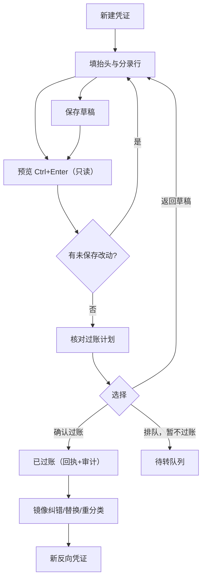

# 凭证流程

```mermaid
flowchart TD
  A["新建凭证"] --> B["填抬头与分录行"]
  B --> C["保存草稿"]
  B --> P["预览 Ctrl+Enter（只读）"]
  C --> P
  P --> U{"有未保存改动?"}
  U -- 是 --> B
  U -- 否 --> R["核对过账计划"]
  R --> D{"选择"}
  D -- 确认过账 --> OK["已过账（回执+审计）"]
  D -- 排队，暂不过账 --> Q["待转队列"]
  D -- 返回草稿 --> B
  OK --> E["镜像纠错/替换/重分类"]
  E --> OK2["新反向凭证"]
```

要点：预览从不保存；确认在事务内重算；已过账不可改，只能镜像纠错。
