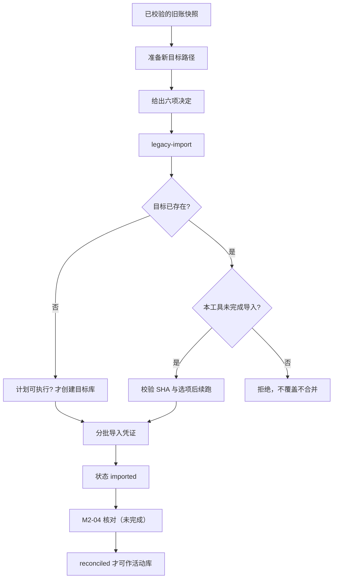

# 旧账导入流程（M2-03，命令行）

```mermaid
flowchart TD
  A["已校验的旧账快照"] --> B["准备新目标路径"]
  B --> C["给出六项决定"]
  C --> D["legacy-import"]
  D --> E{"目标已存在?"}
  E -- 否 --> F["计划可执行? 才创建目标库"]
  E -- 是 --> G{"本工具未完成导入?"}
  G -- 是 --> H["校验 SHA 与选项后续跑"]
  G -- 否 --> I["拒绝，不覆盖不合并"]
  F --> J["分批导入凭证"]
  H --> J
  J --> K["状态 imported"]
  K --> L["M2-04 核对（未完成）"]
  L --> M["reconciled 才可作活动库"]
```

要点：导入全程持独占维护锁；`imported` 的库不能作为活动库打开。核对（M2-04）与期初未结项（M2-03b）尚未交付，所以 v0.2.0 不能完成真实迁移。
