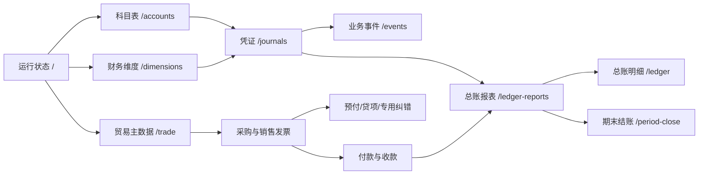

# 总览：页面与主路径

```mermaid
flowchart LR
  OV["运行状态 /"] --> ACC["科目表 /accounts"]
  OV --> DIM["财务维度 /dimensions"]
  OV --> TM["贸易主数据 /trade"]
  ACC --> JR["凭证 /journals"]
  DIM --> JR
  JR --> EV["业务事件 /events"]
  TM --> INV["采购与销售发票"]
  INV --> SET["付款与收款"]
  INV --> ADJ["预付/贷项/专用纠错"]
  JR --> LR["总账报表 /ledger-reports"]
  SET --> LR
  LR --> LD["总账明细 /ledger"]
  LR --> PC["期末结账 /period-close"]
```

细节：[凭证](journal-flow.md)、[贸易](trade-flow.md)、[结账](period-close-flow.md)。侧栏另有“只读报表 → 试算平衡表 /reports/trial”（读取旧快照）和“显示偏好”（[教学开关](teaching-toggle.md)）。
