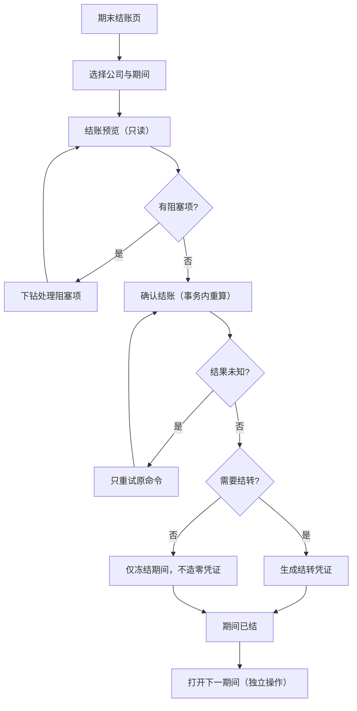

# 期末结账流程

```mermaid
flowchart TD
  A["期末结账页"] --> B["选择公司与期间"]
  B --> C["结账预览（只读）"]
  C --> D{"有阻塞项?"}
  D -- 是 --> E["下钻处理阻塞项"]
  E --> C
  D -- 否 --> F["确认结账（事务内重算）"]
  F --> G{"结果未知?"}
  G -- 是 --> H["只重试原命令"]
  H --> F
  G -- 否 --> K{"需要结转?"}
  K -- 是 --> I["生成结转凭证"]
  K -- 否 --> L["仅冻结期间，不造零凭证"]
  I --> N["期间已结"]
  L --> N
  N --> J["打开下一期间（独立操作）"]
```

年度模式下 1–11 月只冻结；确认结账不会自动打开下一期间。
