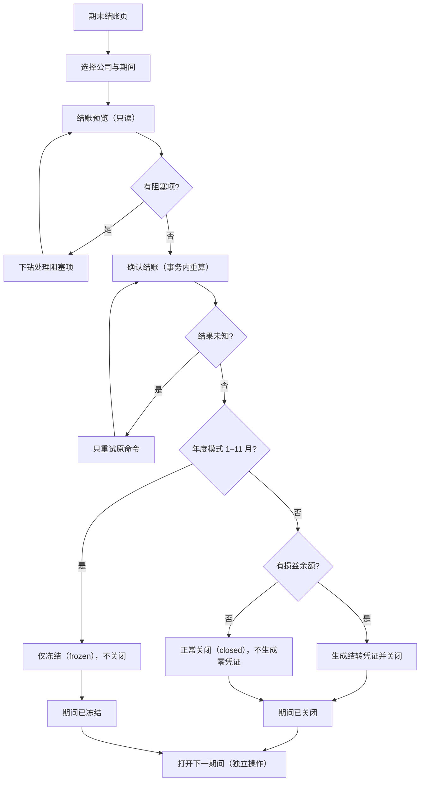

# 期末结账流程

```mermaid
flowchart TD
  A["期末结账页"] --> B["选择公司与期间"]
  B --> C["结账预览（只读）"]
  C --> D{"有阻塞项?"}
  D -- 是 --> E["下钻处理阻塞项"]
  E --> C
  D -- 否 --> F["确认结账（事务内重算）"]
  F --> G{"结果未知?"}
  G -- 是 --> H["只重试原命令"]
  H --> F
  G -- 否 --> M{"年度模式 1–11 月?"}
  M -- 是 --> L["仅冻结（frozen），不关闭"]
  M -- 否 --> K{"有损益余额?"}
  K -- 是 --> I["生成结转凭证并关闭"]
  K -- 否 --> P["正常关闭（closed），不生成零凭证"]
  I --> N["期间已关闭"]
  P --> N
  L --> Q["期间已冻结"]
  N --> J["打开下一期间（独立操作）"]
  Q --> J
```

分支：年度模式 1–11 月只冻结，不关闭；年度 12 月或月度教学模式，无损益余额则正常关闭、不生成零凭证，有损益余额则生成结转凭证后关闭。确认结账不会自动打开下一期间。
