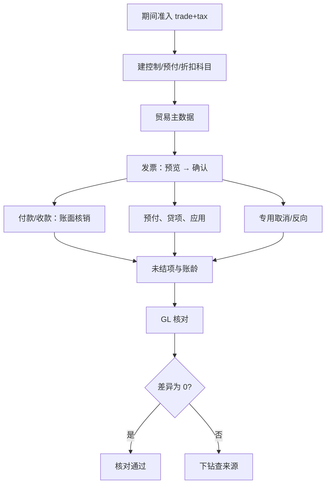
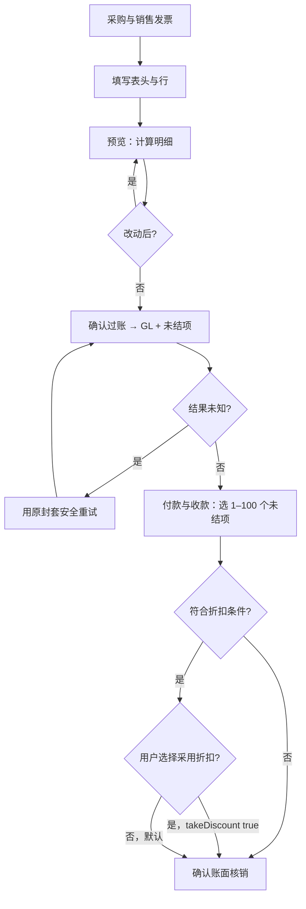
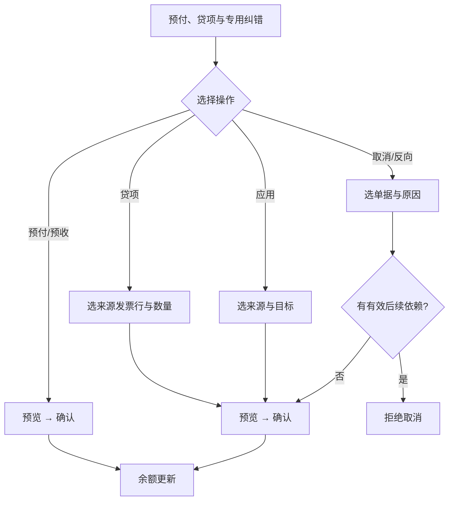
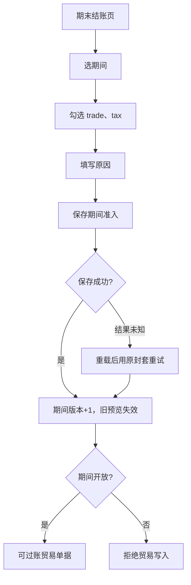
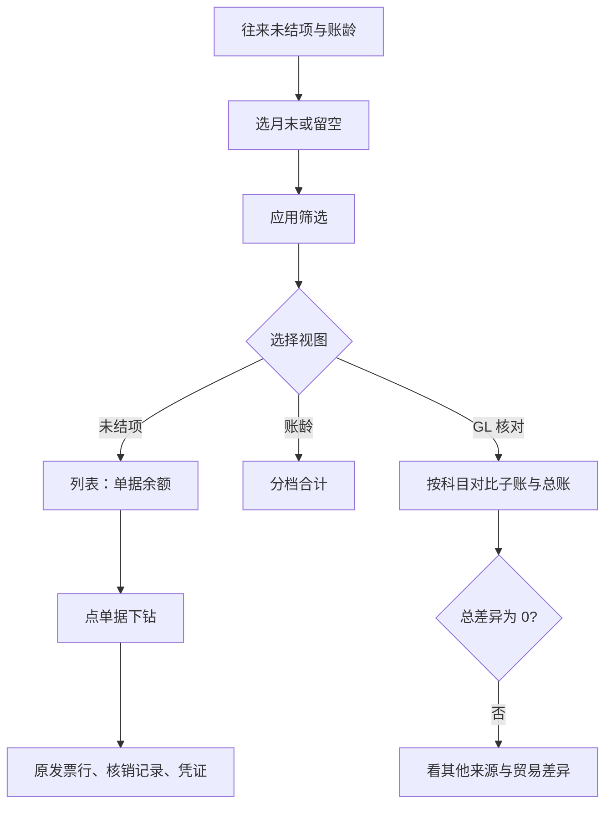

# 贸易流程

## 总图：从准入到核对

```mermaid
flowchart TD
  A["期间准入 trade+tax"] --> B["建控制/预付/折扣科目"]
  B --> C["贸易主数据"]
  C --> D["发票：预览 → 确认"]
  D --> E["付款/收款：账面核销"]
  D --> F["预付、贷项、应用"]
  D --> G["专用取消/反向"]
  E --> H["未结项与账龄"]
  F --> H
  G --> H
  H --> I["GL 核对"]
  I --> J{"差异为 0?"}
  J -- 是 --> K["核对通过"]
  J -- 否 --> L["下钻查来源"]
```

## 发票与付款

```mermaid
flowchart TD
  S["采购与销售发票"] --> P["填写表头与行"]
  P --> V["预览：计算明细"]
  V --> Q{"改动后?"}
  Q -- 是 --> V
  Q -- 否 --> O["确认过账 → GL + 未结项"]
  O --> U{"结果未知?"}
  U -- 是 --> R["用原封套安全重试"]
  R --> O
  U -- 否 --> T["付款与收款：选 1–100 个未结项"]
  T --> W{"符合折扣条件?"}
  W -- 否 --> X["确认账面核销"]
  W -- 是 --> Y{"用户选择采用折扣?"}
  Y -- 是，takeDiscount true --> X
  Y -- 否，默认 --> X
```

“用户选择”一步：符合折扣条件不等于采用折扣，只有勾选“采用现金折扣”才计入。

## 预付、贷项与专用纠错

```mermaid
flowchart TD
  A["预付、贷项与专用纠错"] --> B{"选择操作"}
  B -- 预付/预收 --> C["预览 → 确认"]
  B -- 贷项 --> D["选来源发票行与数量"]
  B -- 应用 --> E["选来源与目标"]
  B -- 取消/反向 --> F["选单据与原因"]
  D --> G["预览 → 确认"]
  E --> G
  F --> H{"有有效后续依赖?"}
  H -- 是 --> I["拒绝取消"]
  H -- 否 --> G
  C --> J["余额更新"]
  G --> J
```

## 期间准入

```mermaid
flowchart TD
  A["期末结账页"] --> B["选期间"]
  B --> C["勾选 trade、tax"]
  C --> D["填写原因"]
  D --> E["保存期间准入"]
  E --> F{"保存成功?"}
  F -- 是 --> G["期间版本+1，旧预览失效"]
  F -- 结果未知 --> H["重载后用原封套重试"]
  H --> G
  G --> I{"期间开放?"}
  I -- 是 --> J["可过账贸易单据"]
  I -- 否 --> K["拒绝贸易写入"]
```

## 未结项、账龄与 GL 核对

```mermaid
flowchart TD
  A["往来未结项与账龄"] --> B["选月末或留空"]
  B --> C["应用筛选"]
  C --> D{"选择视图"}
  D -- 未结项 --> E["列表：单据余额"]
  D -- 账龄 --> F["分档合计"]
  D -- GL 核对 --> G["按科目对比子账与总账"]
  E --> H["点单据下钻"]
  H --> I["原发票行、核销记录、凭证"]
  G --> J{"总差异为 0?"}
  J -- 否 --> K["看其他来源与贸易差异"]
```

通用凭证冲销不适用于贸易凭证；旧账导入凭证（`LEGACY`）在核对中列为“其他来源”。
