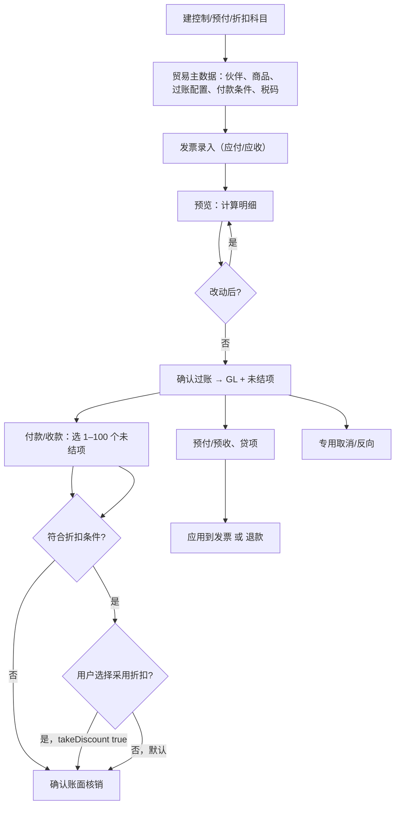

# 贸易流程（预览）

```mermaid
flowchart TD
  S0["建控制/预付/折扣科目"] --> M["贸易主数据：伙伴、商品、过账配置、付款条件、税码"]
  M --> I["发票录入（应付/应收）"]
  I --> IP["预览：计算明细"]
  IP --> IC{"改动后?"}
  IC -- 是 --> IP
  IC -- 否 --> IO["确认过账 → GL + 未结项"]
  IO --> ST["付款/收款：选 1–100 个未结项"]
  ST --> SD{"符合折扣?"}
  ST --> SD{"符合折扣条件?"}
  SD -- 否 --> SC["确认账面核销"]
  SD -- 是 --> SU{"用户选择采用折扣?"}
  SU -- 是，takeDiscount true --> SC
  SU -- 否，默认 --> SC
  IO --> AD["预付/预收、贷项"]
  AD --> AP["应用到发票 或 退款"]
  IO --> CX["专用取消/反向"]
```

未包含：未结项/账龄报表（M1-06）。通用凭证冲销不适用于贸易凭证。
