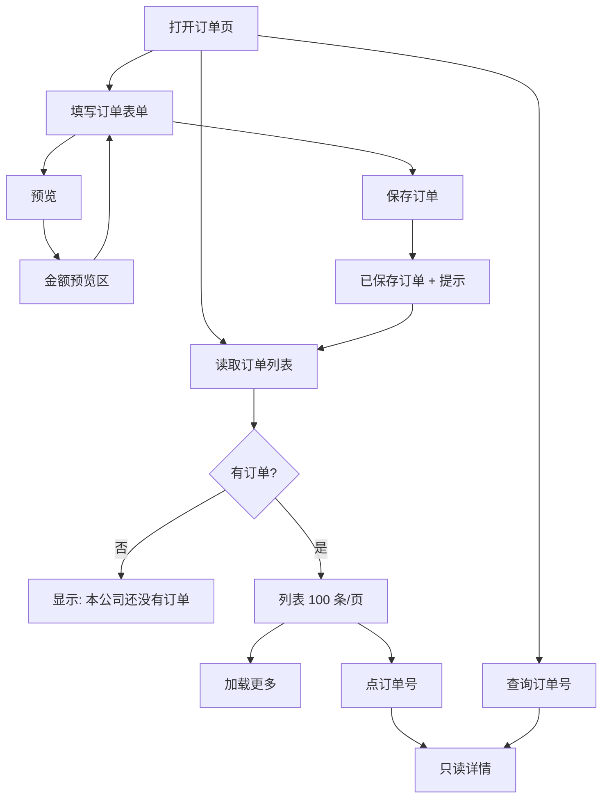
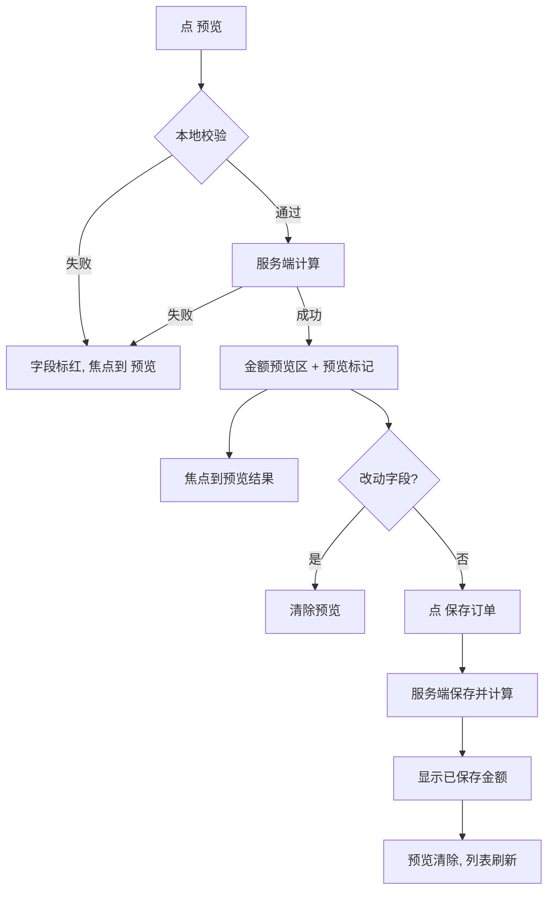
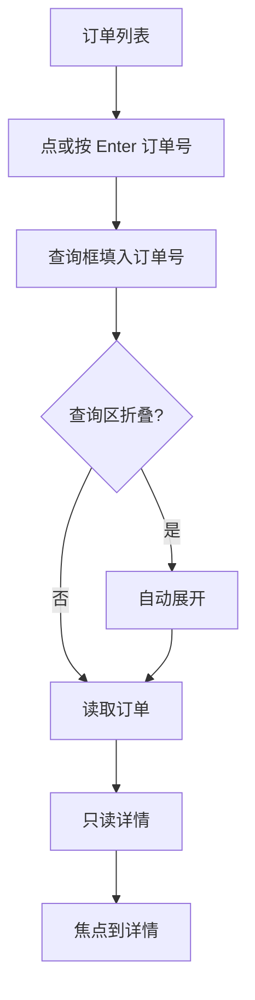

# 采购 / 销售订单页流程（v0.6.0）

页面：`#/trade-orders`。订单不过账、不生成凭证。图中按钮名取自界面中文标签；与代码不一致时以代码和测试为准。

## 总图：列表、预览、保存、查询

```mermaid
flowchart TD
  A[打开订单页] --> B[读取订单列表]
  B --> C{有订单?}
  C -- 否 --> D[显示: 本公司还没有订单]
  C -- 是 --> E[列表 100 条/页]
  E --> F[加载更多]
  A --> G[填写订单表单]
  G --> H[预览]
  H --> I[金额预览区]
  I --> G
  G --> J[保存订单]
  J --> K[已保存订单 + 提示]
  K --> B
  E --> L[点订单号]
  L --> M[只读详情]
  A --> N[查询订单号]
  N --> M
```

## 细节：预览与保存

```mermaid
flowchart TD
  A[点 预览] --> B{本地校验}
  B -- 失败 --> C[字段标红, 焦点到 预览]
  B -- 通过 --> D[服务端计算]
  D -- 失败 --> C
  D -- 成功 --> E[金额预览区 + 预览标记]
  E --> F[焦点到预览结果]
  E --> G{改动字段?}
  G -- 是 --> H[清除预览]
  G -- 否 --> I[点 保存订单]
  I --> J[服务端保存并计算]
  J --> K[显示已保存金额]
  K --> L[预览清除, 列表刷新]
```

## 细节：从列表查看

```mermaid
flowchart TD
  A[订单列表] --> B[点或按 Enter 订单号]
  B --> C[查询框填入订单号]
  C --> D{查询区折叠?}
  D -- 是 --> E[自动展开]
  D -- 否 --> F[读取订单]
  E --> F
  F --> G[只读详情]
  G --> H[焦点到详情]
```
